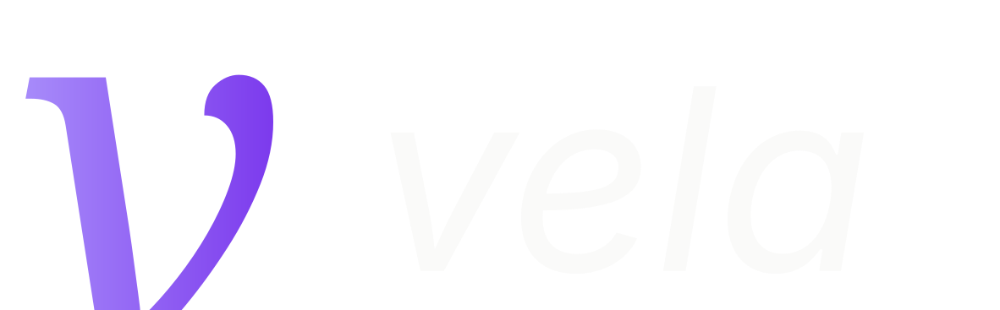
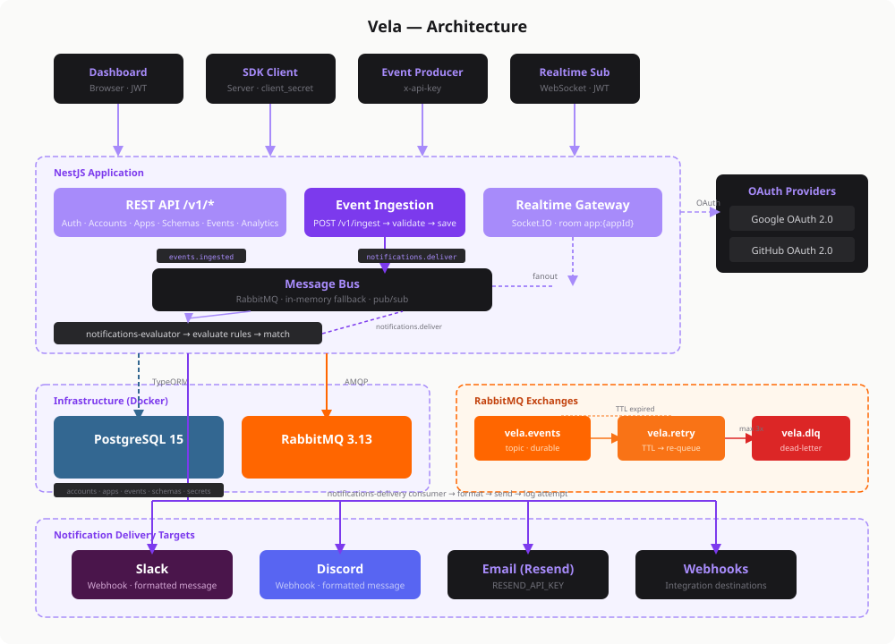

<div align="center">

<picture>
  <source media="(prefers-color-scheme: dark)" srcset="assets/logo-dark.svg" />
  <source media="(prefers-color-scheme: light)" srcset="assets/logo-light.svg" />
  
</picture>

### Open-source event ingestion and notification platform

Ingest structured events. Evaluate rules in real time. Deliver alerts to Slack, Discord, Email, and webhooks.

[](LICENSE)
[](https://github.com/vela-event/vela/actions)
[](#)
[](#)
[](#contributing)
[](https://www.npmjs.com/package/@vela-event/sdk)
[](https://www.npmjs.com/package/@vela-event/cli)

[Getting Started](#getting-started) · [Docs](https://docs.velahq.xyz) · [SDKs](#sdks) · [Contributing](#contributing)

</div>

---

## The Problem

You're building a product. Users do things — place orders, sign up, hit errors. You need to:

1. **Capture** those events in a structured way
2. **Decide** which ones matter (and to whom)
3. **Notify** the right channel — Slack, Discord, email, webhook

Most teams duct-tape this together with scattered `if` statements, cron jobs, and a tangle of integrations. It breaks silently. It doesn't scale. Nobody wants to maintain it.

## How Vela Solves It

```
Your App → Vela SDK → Event Ingestion → Schema Validation
                                              ↓
                                        Rules Engine → Condition Matching
                                              ↓
                                     Delivery Layer → Slack / Discord / Email / Webhook
                                              ↓
                                        Retry + DLQ → Guaranteed Delivery
```

**One API call** to ingest events. **One rules engine** to decide what matters. **One delivery layer** to reach the right channel — with retries, dead-letter queues, and full delivery tracking.

## Features

- **Schema-validated ingestion** — Define event schemas as JSON. Invalid payloads are rejected at the door.
- **Rules engine** — Create notification rules with conditions on any event field. No code changes needed.
- **Multi-channel delivery** — Slack, Discord, Email (via Resend), and custom webhooks out of the box.
- **Reliable delivery** — RabbitMQ-backed retry with exponential backoff and dead-letter queues.
- **Real-time streaming** — WebSocket (Socket.IO) endpoint for live dashboards and event feeds.
- **Analytics API** — Time-series charts, stat cards, delivery success rates, and event breakdowns.
- **Multi-tenant** — Accounts, apps, API key rotation, and client secret management.
- **Schema-as-code** — Version-control your event schemas. Diff, push, and pull via CLI.
- **Self-hosted** — Docker Compose with PostgreSQL + RabbitMQ. Your data stays on your infrastructure.

## Architecture

<p align="center">
  
</p>

## Getting Started

### 1. Clone and configure

```bash
git clone https://github.com/vela-event/vela.git
cd vela
cp .env.sample .env
```

Edit `.env` and set `JWT_SECRET` and `CREDENTIALS_ENCRYPTION_KEY` to strong random values.

### 2. Start infrastructure

```bash
docker compose -f docker-compose.infra.yml up -d
```

### 3. Install and run

```bash
pnpm install
pnpm migration:run
pnpm start:dev
```

API is live at `http://localhost:3000`. Swagger docs at `http://localhost:3000/docs`.

### 4. Ingest your first event

```bash
curl -X POST http://localhost:3000/v1/ingest \
  -H "Content-Type: application/json" \
  -H "x-api-key: YOUR_API_KEY" \
  -d '{
    "event": "order.placed",
    "data": { "orderId": "ord_123", "amount": 99.00 },
    "level": "info"
  }'
```

## SDKs

Install a SDK and start ingesting events in minutes.

### TypeScript / JavaScript

```bash
npm install @vela-event/sdk
```

```typescript
import { Vela } from '@vela-event/sdk';

const vela = new Vela('your_api_key');

await vela.ingest({
  event: 'order.placed',
  data: { orderId: 'ord_123', amount: 99.00 },
  level: 'info',
});
```

### Python

```bash
pip install vela-sdk
```

```python
from vela import Vela

vela = Vela("your_api_key")

vela.ingest(
    event="order.placed",
    data={"orderId": "ord_123", "amount": 99.00},
    level="info",
)
```

### CLI

```bash
npm install -g @vela-event/cli
```

```bash
vela diff     # Preview pending schema changes
vela push     # Push local schemas to Vela
vela pull     # Pull remote schemas to local files
```

| Package | npm | Source | Docs |
|---------|-----|--------|------|
| `@vela-event/sdk` | [](https://www.npmjs.com/package/@vela-event/sdk) | [packages/sdk](packages/sdk) | [docs.velahq.xyz/sdks/typescript](https://docs.velahq.xyz/sdks/typescript/overview) |
| `vela-sdk` (Python) | [](https://pypi.org/project/vela-sdk/) | [packages/sdk-python](packages/sdk-python) | [docs.velahq.xyz/sdks/python](https://docs.velahq.xyz/sdks/python/overview) |
| `@vela-event/cli` | [](https://www.npmjs.com/package/@vela-event/cli) | [packages/cli](packages/cli) | [docs.velahq.xyz/cli](https://docs.velahq.xyz/cli/overview) |

## Schema-as-Code

Define your event schemas as JSON files and version-control them alongside your code:

```json
{
  "event": "order.placed",
  "description": "Fired when a customer places a new order",
  "schema": {
    "type": "object",
    "required": ["orderId", "amount"],
    "properties": {
      "orderId": { "type": "string" },
      "amount": { "type": "number" }
    }
  }
}
```

```bash
vela diff   # See what changed
vela push   # Deploy to Vela
```

Events that don't match the schema are rejected at ingest time. No bad data gets through.

## Documentation

Full documentation is at **[docs.velahq.xyz](https://docs.velahq.xyz)**.

| Guide | Description |
|-------|-------------|
| [Quickstart](https://docs.velahq.xyz/quickstart) | Send your first event in under 5 minutes |
| [Core Concepts](https://docs.velahq.xyz/concepts) | Apps, schemas, events, rules, destinations |
| [TypeScript SDK](https://docs.velahq.xyz/sdks/typescript/overview) | Ingest and management client reference |
| [Python SDK](https://docs.velahq.xyz/sdks/python/overview) | Python client reference |
| [CLI](https://docs.velahq.xyz/cli/overview) | Schema-as-code with diff, push, pull |
| [API Reference](https://docs.velahq.xyz/api-reference/introduction) | Full HTTP API docs |

## Self-Hosting

Vela is designed to run on your infrastructure. The only dependencies are PostgreSQL and RabbitMQ, both included in the Docker Compose file.

```bash
docker compose -f docker-compose.infra.yml up -d  # Start Postgres + RabbitMQ
pnpm start:prod                                     # Start Vela
```

Deploy anywhere: a VPS, Railway, Render, Fly.io, or your own Kubernetes cluster.

## Roadmap

- [ ] Webhook destinations with signature verification
- [ ] Rate limiting per app / API key
- [ ] Event replay and backfill
- [ ] Terraform provider
- [ ] One-click deploy (Railway, Render, Fly.io)
- [ ] Dashboard UI improvements
- [ ] More notification channels (Teams, PagerDuty, Telegram)
<!-- 
See the [project board](https://github.com/vela-event/vela/projects) for what's in progress. -->

## Contributing

We welcome contributions of all kinds — code, docs, bug reports, feature requests.

```bash
# Fork and clone the repo
pnpm install
cp .env.sample .env
docker compose -f docker-compose.infra.yml up -d
pnpm start:dev
```

See [CONTRIBUTING.md](CONTRIBUTING.md) for commit conventions, branch naming, and PR guidelines.

## Community

- [GitHub Discussions](https://github.com/vela-event/vela/discussions) — Questions, ideas, show & tell
- [Discord](https://discord.gg/vela) — Chat with the community
- [Twitter](https://twitter.com/vela_events) — Updates and announcements

## Security

Found a vulnerability? Please report it responsibly. See [SECURITY.md](SECURITY.md).

## License

Vela is open source under the [AGPL-3.0 License](LICENSE).

---

<div align="center">

**If Vela is useful to you, consider giving it a star.**

[](https://github.com/vela-event/vela)

</div>
